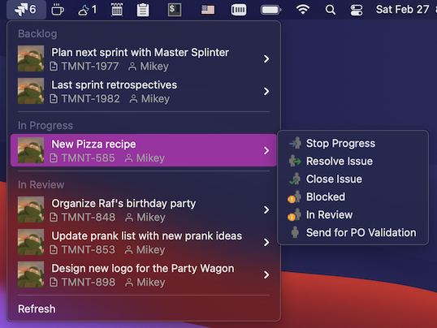

# Jira Menu Bar App

Shows a list of Jira tickets grouped by a status which are assigned to a user:



By default it shows a list of tickets returned by a following JQL: 

```assignee=currentuser()+AND+resolution=Unresolved```

In order to show a different list (for example issues from the backlog or issues with a label) go to Jira's advanced search, construct a query and use it in the app's config.

# Installation

 - download and install [Hammerspoon](https://github.com/Hammerspoon/hammerspoon/releases/latest)
 - download and install [Jira Spoon]()
 - open ~/.hammerspoon/init.lua and add following snippet:

```lua
-- JIRA
hs.loadSpoon('jira-issues')
spoon['jira-issues']:setup({
    jira_host = 'https://jira.tmnt.ca',
    login = 'mikey',
    password = 'cowabunga123',
    jql = 'project=tmnt'
})
spoon['jira-issues']:start()
```

This app uses icons, to properly display them, install a [feather-font](https://github.com/AT-UI/feather-font) by [downloading](https://github.com/AT-UI/feather-font/raw/master/src/fonts/feather.ttf) this .ttf font and installing it.